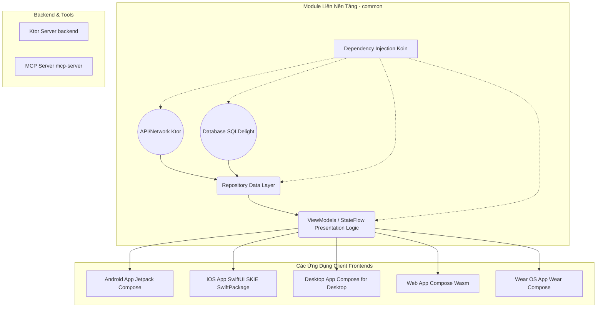

# Phân Tích Kiến Trúc Dự Án PeopleInSpace

Dự án **PeopleInSpace** do John O'Reilly phát triển là một trong những dự án mẫu toàn diện nhất về **Kotlin Multiplatform (KMP)** và **Compose Multiplatform**. Dự án này cho phép chia sẻ toàn bộ business logic, data layer, networking và thậm chí cả UI layer cho nhiều nền tảng khác nhau từ cùng một codebase Kotlin.

Dưới đây là một phân tích chi tiết toàn bộ kiến trúc và các thành phần của dự án.

## 1. Sơ Đồ Kiến Trúc Tổng Quan (Architecture Overview)

## 2. Các Modules Trong Dự Án

### 2.1 `common` (Module Dùng Chung)
Đây là trái tim của dự án, chứa toàn bộ "não bộ" của ứng dụng bao gồm models, network calls, cache và presentation logic (ViewModels).
- **Core Technologies**:
  - **Networking**: Sử dụng **Ktor Client** để thực hiện các lời gọi API REST. Ktor hỗ trợ native-engine tương ứng cho mỗi nền tảng (Ví dụ: `ktor-client-android` cho Android, `ktor-client-darwin` cho iOS, `ktor-client-java` cho JVM).
  - **Local Storage/Caching**: Sử dụng **SQLDelight** với hỗ trợ Coroutines. Nó sẽ tự động sinh (generate) ra Type-Safe Kotlin code từ các truy vấn SQL.
  - **Dependency Injection (DI)**: Sử dụng **Koin** multiplatform và tính năng Koin KSP Annotations để quản lý DI.
  - **Concurrency**: Sử dụng **Kotlin Coroutines** và **Flow/StateFlow** cho tác vụ chạy bất đồng bộ và reactive programming.
  - **Swift Interop**: Cấu hình sử dụng **SKIE** và custom plugin *`multiplatform-swiftpackage`* để đóng gói module Kotlin thành Swift Package (tạo gói *PeopleInSpaceKit*) thân thiện hơn cho dev iOS.

### 2.2 `app` (Android App)
Ứng dụng Android chạy trên di động.
- Trực tiếp implement logic giao diện người dùng dựa trên framework **Jetpack Compose**.
- Gắn kết (bind) với view models và StateFlow từ module `common` để lấy dữ liệu về số người ngoài không gian hoặc trạm vũ trụ ISS.

### 2.3 `wearApp` (Wear OS App)
Ứng dụng dành cho thiết bị đeo chạy Android (đồng hồ thông minh).
- Tương tự như ứng dụng Android, tuy nhiên thiết kế màn hình nhỏ sử dụng thư viện **Compose for Wear OS**.

### 2.4 `PeopleInSpaceSwiftUI` (iOS / watchOS)
Dự án Native Apple dùng ngôn ngữ **Swift** và framework UI **SwiftUI**.
- Thay vì dùng Compose, module này tận dụng native UI của Apple để mang lại trải nghiệm 100% native.
- Sử dụng module `common` qua bộ khung *PeopleInSpaceKit* Swift Package để gọi các hàm Kotlin StateFlow/Suspend. Tính năng **SKIE** hỗ trợ chuyển đổi Coroutines Flow thành các Combine Publisher hoặc Async/Await của Swift một cách tự nhiên.

### 2.5 `compose-desktop` (Desktop App)
Ứng dụng chạy trên máy tính (macOS, Windows, Linux).
- Biên dịch thông qua Kotlin JVM.
- Sử dụng thư viện **Compose Multiplatform (Desktop OS)** để dùng chung mã UI/Components (thậm chí có file shared UI trong `common`).

### 2.6 `compose-web` (Web Browser App)
Ứng dụng chạy trên nền tảng Web.
- Ứng dụng này sử dụng **Compose dành cho Web (sắm biên dịch sang WebAssembly - WasmJs)**. Điều này cho phép ứng dụng chạy trực tiếp cấu trúc Compose trên Canvas hoặc qua trình dịch WasmDOM mà không cần javascript cồng kềnh.

### 2.7 `backend` (Server-side app)
Dự án mẫu cho Server (backend) được viết bằng Kotlin.
- Sử dụng framework **Ktor Server** để cung cấp backend. Mô phỏng cách một project KMP có thể để chung cả mã Client và Server trong một mono-repo, tiến tới có thể chia sẻ cả Data Model (DTO classes) giữa backend API và Frontend Client.

### 2.8 Các modules khác
- **`mcp-server`**: Model Context Protocol integration. Hỗ trợ cung cấp cho LLMs các context cho việc suy diễn data của ứng dụng PeopleInSpace.
- **`SwiftExecutablePackage`**: Gói thực thi dòng lệnh thuần Swift, ví dụ để minh hoạ một chương trình CLI nhỏ trên Mac gọi vào framework KMP chung.
- **`maestro`**: Thư mục chứa các kịch bản test tự động e2e UI bằng công cụ **Maestro** (dùng được cho đa nền tảng mobile).

## 3. Quy Trình Vận Hành Dữ Liệu (Data Flow)

1. **Giao Diện (UI)** gọi một hàm (Intent/Action) từ **ViewModel/Presenter** nằm ở `common`.
2. **ViewModel** gọi xuống **Repository**.
3. **Repository** đầu tiên sẽ kiểm tra xem liệu trong **SQLite Database** (thông qua SQLDelight) đã có dữ liệu chưa.
    - Nếu có, trả ngay kết quả đó ra UI (Single source of truth) dưới dạng một chuỗi `Flow`.
    - Đoạn sau đó hoặc nếu dữ liệu trống, gọi **Ktor Client** lên API thật để fetch payload mới nhất.
4. **Ktor** fetch dữ liệu JSON, phân tích bằng **Kotlinx Serialization**.
5. Nhận được model dữ liệu mới, lưu (Insert/Update) vào **SQL Database**.
6. **SQL Database** thông báo sự thay đổi (Reactive Stream qua Flow).
7. **ViewModel** tự động cập nhật *State* (StateFlow).
8. Các UI **Compose** (Android/Desktop/Web) hoặc **SwiftUI** (Apple) tự động re-render dữ liệu mới.

---

**Tổng kết:** Dự án này là chuẩn mực về cách phân chia ranh giới theo Clean Architecture trong mô hình đa nền tảng Kotlin (KMP). Nó giữ được sự đồng nhất về Business/Logic trên mọi thiết bị trong khi đó vẫn tôn trọng trải nghiệm Native App (với giao diện được viết bằng Android Compose hoặc SwiftUI).
